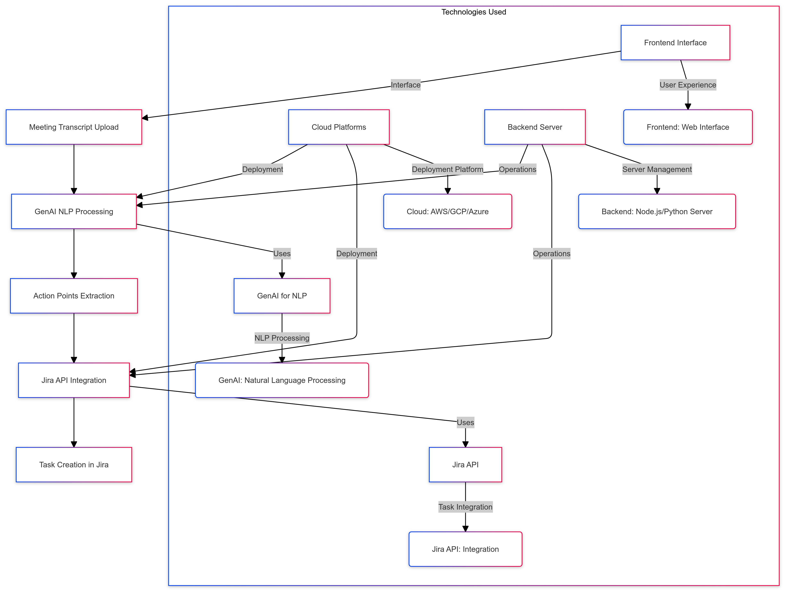

# Team6_272Project

**Project Title:**
AI-Powered Meeting Summarization and Action Points Generator with Jira Integration

**Description:**
Meetings are essential in enterprises, but manual note-taking and task creation often lead to missed details, delays, and lack of accountability. This project leverages AI to automatically summarize meetings and extract action points from transcripts, then directly integrates these points with Jira through its API. This automation ensures that important tasks are captured accurately and assigned promptly, improving team efficiency and project delivery timelines.

**Technologies:**
GenAI: For natural language processing and summarization.
Jira API: To integrate extracted action points into Jira as tasks or stories.
Cloud Platforms: (AWS, GCP, or Azure) for deploying the service.
Frontend: A user-friendly web interface for uploading transcripts and viewing summaries.
Backend: Node.js or Python-based server to handle requests, process transcripts, and communicate with Jira API.

**Use Cases Persona Summary:**
Project Managers: Automatically generate meeting summaries and action points, saving time in task creation and follow-up.
Team Members: Receive clear, automatically generated tasks in Jira, ensuring nothing from the meeting is missed or forgotten.
Executives: Ensure accountability and efficient follow-through on key decisions discussed during meetings.

**Architecture Diagram**

